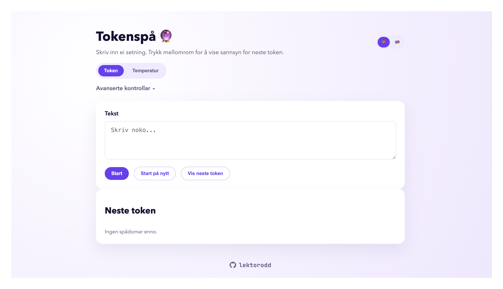

# Tokenspå 🔮



## 1) Kva gjer appen?
Tokenspå viser kva modellen trur kjem **neste**, og korleis **temperatur** og sampling‑val endrar token‑vala.

- **Token‑fana** viser eit sannsyns‑diagram for neste token.
- **Temperatur‑fana** viser fleire parallelle forslag med ulike temperaturar.
- Under **Avanserte kontrollar** finn du:
  - **`top_p`**: avgrensar utvalet til dei mest sannsynlege tokena.
  - **`top_k`**: kor mange av dei mest sannsynlege tokena som blir viste.
  - **Token per steg**: kor mange token som blir henta per steg i temperatur‑fana.

## 2) Kom i gang

### Steg A: Få ein OpenAI API‑nøkkel
1. Logg inn på OpenAI‑kontoen din.
2. Lag ein ny API‑nøkkel.
3. Ta vare på nøkkelen.

### Steg B: Få appen på maskina di
1. Last ned eller klon prosjektet til maskina di.
2. Opne eit terminal‑vindauge i prosjektmappa.

### Steg C: Set opp nøkkelen
1. Lag ei fil som heiter `.env` i prosjektmappa.
2. Legg inn nøkkelen slik:
```
OPENAI_API_KEY=din_nøkkel_her
```
Denne fila er lokal og blir ikkje brukt av appen utan at du lagar ho sjølv. Del aldri API‑nøkkelen offentleg.

### Steg D: Start appen
1. Installer avhengigheiter:
```
npm install
```
2. Start appen:
```
npm run dev
```
3. Opne nettlesaren:
```
http://localhost:3000
```

### Steg E: Bruk appen
- Skriv inn tekst i feltet.
- Trykk **Start** for å låse teksten.
- Bruk **piltastar/space** for å velje og legge til token.
- I **Temperatur‑fana**: Trykk **Neste token** for å avsløre eitt steg i alle felt.
